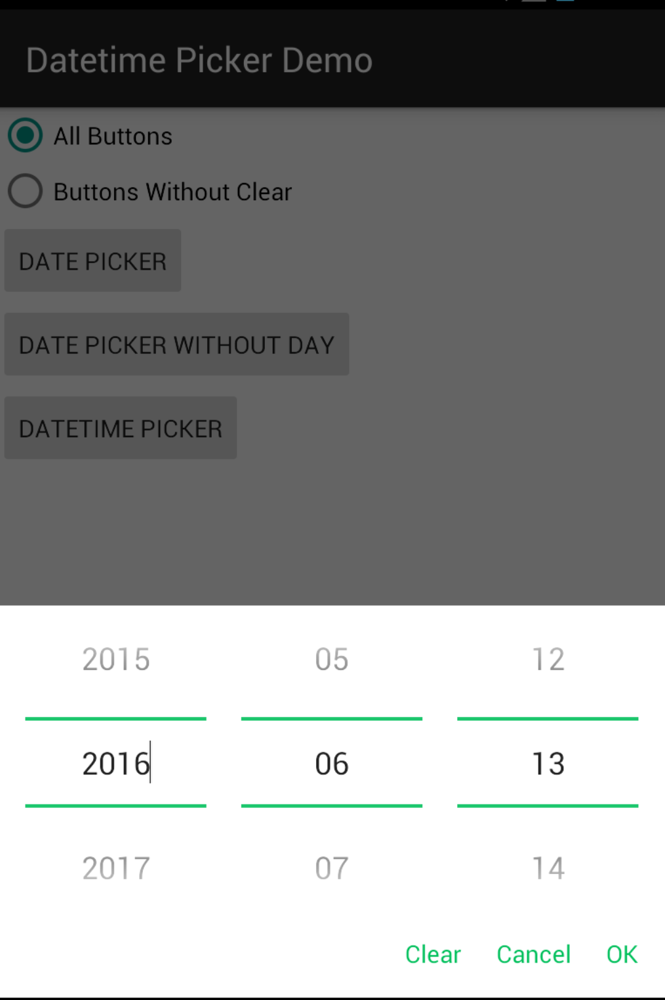
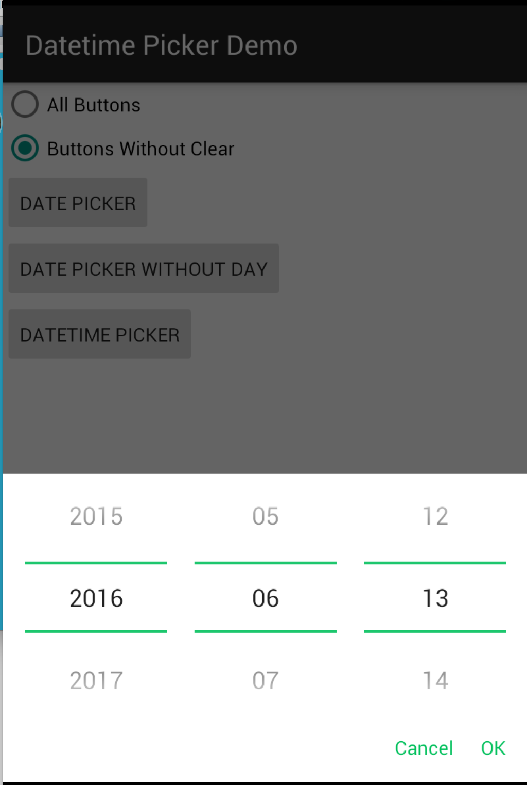
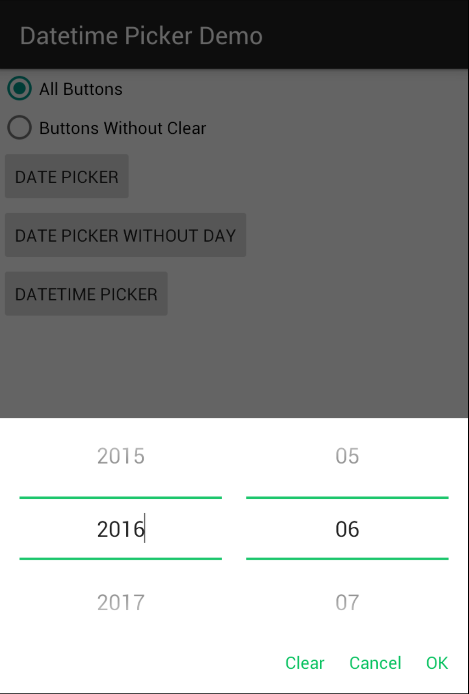
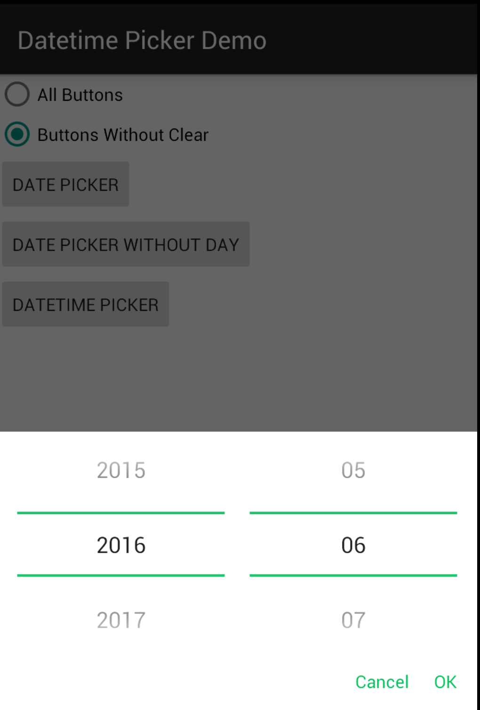
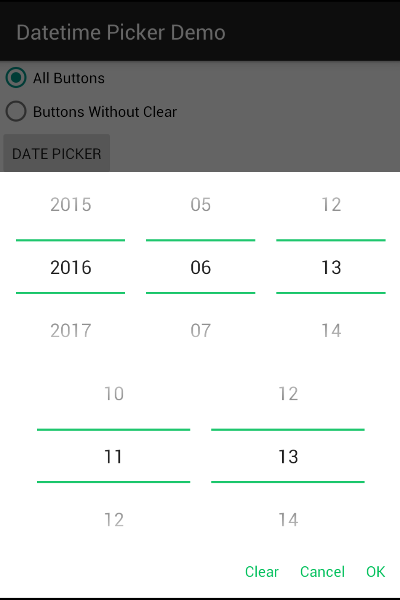
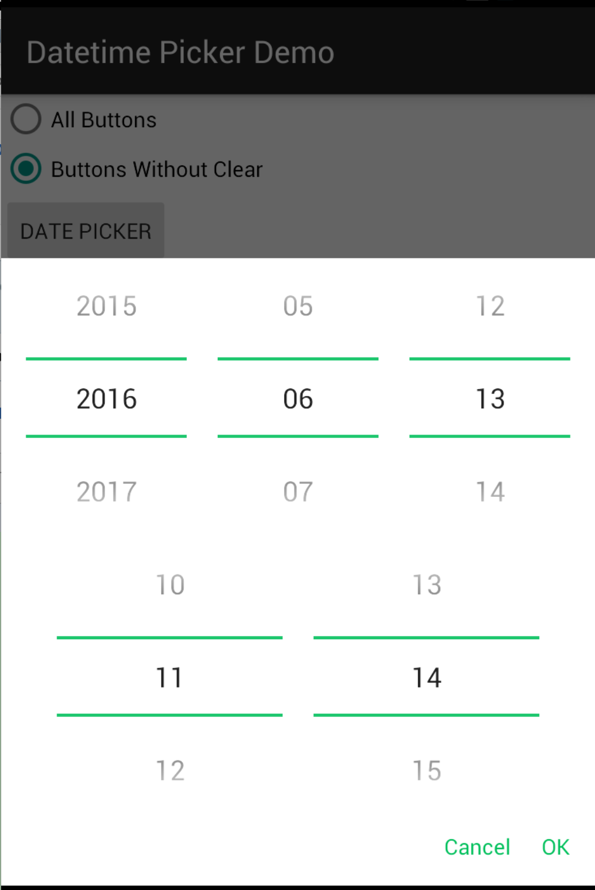

# datetime-picker
Android date &amp; time picker library.

# Screenshots








# Setup

* In your `build.gradle` :

```gradle
repositories {
    maven { url "https://jitpack.io" }
}

dependencies {
    compile 'com.github.nanjingboy:datetime-picker:1.0.1'
}
```

* [Sample](sample/src/main)

# License

MIT